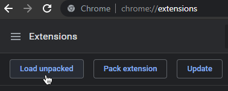

# BdBrowser

BdBrowser is a Chrome extension that loads [BetterDiscord](https://github.com/BetterDiscord/BetterDiscord) in Discord's web client.


## 🗺 Table of Contents

- [Features](#-features)
- [Installation](#-installation)
  - [Installing Prebuilt Version](#installing-prebuilt-version)
  - [Building It Yourself](#building-it-yourself)
- [Using BdBrowser](#-using-bdbrowser)
  - [First Launch](#first-launch)
  - [Installing Plugins and Themes](#installing-plugins-and-themes)
  - [Updating Plugins or Themes](#updating-plugins-or-themes)
  - [Updating BetterDiscord](#updating-betterdiscord)
  - [Updating BdBrowser](#updating-bdbrowser)
  - [Uninstalling BdBrowser](#uninstalling-bdbrowser)
  - [Extension Options](#extension-options)
  - [Backing up the Virtual Filesystem](#backing-up-the-virtual-filesystem)
  - [Restoring from a Backup](#restoring-from-a-backup)
  - [Formatting the Virtual Filesystem](#formatting-the-virtual-filesystem)
  - [Deleting Files in the Virtual Filesystem](#deleting-files-in-the-virtual-filesystem)
  - [Restricting Extension Site Access](#restricting-extension-site-access)
- [Using VfsTool](#-using-vfstool)
  - [Extracting Backup Files](#extracting-backup-files)
  - [Creating Backup Files](#creating-backup-files)

&nbsp;

## 👓 Features

* [Manifest V3](https://developer.chrome.com/docs/extensions/mv3/intro/) extension for [Chromium](https://www.chromium.org)-based browsers.
* Enables the use of [BetterDiscord](https://github.com/BetterDiscord/BetterDiscord)'s unmodified `betterdiscord.asar` in a web browser.
* Emulates a virtual filesystem in memory and persists changes in an IndexedDB.
  
  Plugins do not have access to your real filesystem.
* Service Worker handles outgoing web requests from BetterDiscord components to prevent CORS issues.
* Compatible with all BetterDiscord themes.
* Compatible with most&ast; BetterDiscord plugins.

&nbsp;

## 🛠 Installation

You can either use the ready-made files present in this repository or build BdBrowser yourself.
The latter is useful if you want to audit the code or make changes to it.

&nbsp;

### Installing Prebuilt Version

Since the extension is intentionally not available on the Chrome Web Store, you have to download and install it
manually by downloading a prebuilt release from the GitHub releases page, extracting the archive and loading the
resulting folder as an unpacked Chrome extension while developer mode is enabled:

1. Download the [latest prebuilt extension release as a zip archive](../../releases/latest/).
2. Extract the contents of the zip archive into an empty folder.
3. Open your Chrome extensions page.
4. Make sure the "Developer mode" toggle on the extension page is enabled.
   This enables you to load unpacked extensions from a local folder.
5. Click the <kbd>Load unpacked</kbd> button in the toolbar:
   
   
   
   Now select the folder from step 2 you extracted the archive contents into.
6. Congratulations, you should see the extension loaded and working!
   Once you reload your [Discord](https://discord.com/channels/@me) tab, BetterDiscord should load and show the changelog.

&nbsp;

### Building It Yourself

Building BdBrowser yourself comes with a few prerequisites:

- [Git](https://git-scm.com)
- [Node.js](https://nodejs.org)
- [pnpm](https://pnpm.io)
- A terminal or command prompt

&nbsp;

**Step 1: Clone the BdBrowser repository**

```sh
git clone https://github.com/tsukasa/BdBrowser.git BdBrowser
```

**Step 2: Install BdBrowser's dependencies**
```sh
cd BdBrowser
pnpm install
```

**Step 3: Build BdBrowser**
```sh
pnpm run build-prod
```

**Step 4: Load the Extension**
1. Open your Chrome extensions page.
2. Make sure the "Developer mode" toggle on the extension page is enabled.
   This enables you to load unpacked extensions from a local folder.
3. Click the <kbd>Load unpacked</kbd> button in the toolbar:
   
   
   
   Now select the `dist` folder in the BdBrowser repository.

&nbsp;

## 🎨 Using BdBrowser
Using BdBrowser is almost exactly the same as using BetterDiscord on your desktop.

### First Launch
After enabling the extension and reloading Discord's web client, BdBrowser will
initialize its internal virtual filesystem and download a copy of the latest
`betterdiscord.asar` from BetterDiscord's official GitHub releases page.

BetterDiscord will be loaded from within the asar file in the virtual filesystem
afterwards.

Subsequent starts will be quicker because no initialization or download needs
to take place.

&nbsp;

### Installing Plugins and Themes
You can install plugins/themes by pressing the <kbd>Open [...] Folder</kbd> button in the plugins/themes
category of BetterDiscord's settings.

Instead of opening the folder containing your plugins/themes, a file picker will open.
Choose one or multiple files of the same type (plugins or themes).

The files will get installed into the virtual filesystem and will be available through their
respective category immediately afterwards.

&nbsp;

### Updating Plugins or Themes
You can use the normal ways of updating plugins or themes:
* Use the Updater in the settings.
* Use plugin-specific update routines.
* Use the Plugin Repo or Theme Repo plugins.

Of course, you can also download a copy of the updated file manually and add it to the
virtual filesystem again. You do not need to remove the old file, following the instructions
for [installing plugins/themes](#installing-plugins-and-themes) automatically overwrites a
file if it already exists.

&nbsp;

### Updating BetterDiscord
BetterDiscord got updated? Updating within BdBrowser is just as simple as on the desktop:

* Recommended: [Create a VFS backup!](#backing-up-the-virtual-filesystem)
* Open the Discord settings.
* Navigate to BetterDiscord's "Updates" category.
* Install the available BetterDiscord update by clicking the <kbd>Update!</kbd> button.
* You will be prompted to reload the site.

In case BetterDiscord does no longer work after the update, you should
[restore the old version](#restoring-from-a-backup) from a backup and check
if there might be a new version of BdBrowser available that addresses the issue.

If a new version of the extension is available, please follow the instructions to
[update BdBrowser](#updating-bdbrowser).

&nbsp;

### Updating BdBrowser
BetterDiscord is no longer working within BdBrowser? BdBrowser got updated?
Then it might be time to update your local BdBrowser installation to ensure
you have all the latest compatibility improvements and bug fixes.

Updating the extension is pretty much a repeat of [installing it](#-installation) with a few
notable differences:

* Use the same folder as you did for the installation.
* You do not need to load the unpacked folder again because it is already loaded.
  Uninstalling the old version does not delete your BdBrowser settings or filesystem.
* Instead, please click the <kbd>Update</kbd> button on your Chrome extension page.
* After updating, please perform a hard reload of Discord's page (<kbd>Shift</kbd> + <kbd>F5</kbd>).

Note: Simply replacing the files/folder and restarting Chrome is _not_ sufficient.

&nbsp;

### Uninstalling BdBrowser
To uninstall BdBrowser, simply remove the extension as you would with every other
Chrome extension.

The data stored within the virtual filesystem will be kept.

&nbsp;

### Extension Options
BdBrowser has a few extension options that you can access either by right-clicking the
extension icon in your toolbar or the <kbd>Details</kbd> button on Chrome's extensions page.

&nbsp;

**Do not load BetterDiscord Renderer**

When loading a Discord tab while the option is active, BdBrowser will initialize
the virtual filesystem but not inject BetterDiscord's renderer into the active page.

This is useful if you are stuck in a reload loop or experience crashes due to a
BetterDiscord or plugin failure and want to diagnose, backup, or import data in
the virtual filesystem.

&nbsp;

**Disable all Plugins on Reload**

On the next load of a Discord tab, BetterDiscord's plugin.json will be altered by
BdBrowser to disable all BetterDiscord plugins before injecting BetterDiscord's
renderer.

This option automatically turns itself off again after it was used.

&nbsp;

**Delete Asar from VFS on Reload**

Automatically deletes the `betterdiscord.asar` file from the virtual filesystem on
the next load of a Discord tab. Doing so will prompt BdBrowser's asar updater to
download a fresh copy of BetterDiscord's latest asar file from BetterDiscord's GitHub
releases.

Using this option is tantamount to re-installing BetterDiscord on a regular desktop
client and is sometimes the only option to fix crashes caused by incompatibilities
between BetterDiscord's renderer and the Discord web application.

User data like plugins, themes, or settings are unaffected by this option and stay
untouched.

This option automatically turns itself off again after it was used.

&nbsp;

### Backing up the Virtual Filesystem
Backups are great. You can download a serialized copy of your virtual filesystem
through the console:

```javascript
require("fs").exportVfsBackup();
```

&nbsp;

### Restoring from a Backup
If you made a [backup](#backing-up-the-virtual-filesystem) of your virtual filesystem,
you can restore it at any point.

Open the console and use the following command:
```javascript
require("fs").importVfsBackup();
```

A file picker will open. Choose a [backup](#backing-up-the-virtual-filesystem) file.

All files contained within the backup will be restored to the version serialized in
the backup. Files that do not exist in the backup stay untouched.

After importing the backup, please refresh the page.

&nbsp;

### Formatting the Virtual Filesystem
If you want to format the virtual filesystem and start over from scratch, you can
manually trigger this via the console:

```javascript
require("fs").formatVfs(true);
```

Entering this command will immediately wipe the virtual filesystem.

Please reload the page after using the command.

&nbsp;

### Deleting Files in the Virtual Filesystem
In some rare cases you might want to remove orphaned or ill-behaving files from the extension's virtual filesystem
but cannot find/uninstall them through BetterDiscord's settings.

You can perform these operations via your browser's developer tools console:

```javascript
/* Read the contents of the virtual plugins folder */
require("fs").readdirSync(BdApi.Plugins.folder)
/* Removes the file named "SomePluginName.plugin.js" from the virtual plugins folder */
require("fs").unlinkSync(require("path").join(BdApi.Plugins.folder, "SomePluginName.plugin.js"))
```

Reload the Discord tab afterwards.

&nbsp;

### Restricting Extension Site Access
By default, BdBrowser is allowed to read and change all your data on all sites through
the extension's "Site access" setting (accessible through Chrome's extension page and
clicking the Details button for an extension).

The default is set liberally so that all web requests handled by the service worker
will work out of the box. Otherwise, the user would manually have to configure
the allowed domains beforehand as part of the onboarding/installation.

If you know exactly which domains your specific set of themes/plugins query,
you can harden the configuration by changing the Site Access setting from
`On all sites` to `On specific sites` and adding the allowed domains manually.

&nbsp;

## 🧰 Using VfsTool
BdBrowser comes with the `VfsTool.ps1` Powershell script that allows you to create and
extract virtual filesystem files.

The script is located under `assets/scripts/VfsTool.ps1` in the extension directory.

&nbsp;

### Extracting Backup Files
If you have an existing [backup file](#backing-up-the-virtual-filesystem), you can extract its contents
with this command:

```powershell
.\VfsTool.ps1 -Operation Extract -Path C:\path\to\your\bdbrowser_backup.json -OutputPath C:\temp
```

The output path has to exist already, otherwise the script will fail.

&nbsp;

### Creating Backup Files
You can create a virtual filesystem backup file for use in BdBrowser from your real filesystem -
whether this is from using your existing BetterDiscord appdata or a tailor-made structure of files
to inject files into the virtual filesystem.

The resulting files can be [imported into the virtual filesystem](#restoring-from-a-backup).

&nbsp;

**Create a Backup from your real AppData**

Using the VfsTool you can easily create a backup that contains your current BetterDiscord configuration
(themes, plugins and BetterDiscord settings) for use in BdBrowser.

```powershell
.\VfsTool.ps1 -Operation Create -Path "$($env:APPDATA)\betterdiscord" -OutputPath C:\temp\bdbrowser_backup_MyRealBdConfig.json
```

&nbsp;

**Create a Backup containing a custom BetterDiscord asar File**

Since a [restore](#restoring-from-a-backup) only overwrites files present in the backup itself,
you can create handy partial backup files to up- or downgrade BetterDiscord via VfsTool:

Step 1: Create an empty root directory.

```sh
mkdir bdtemp
```

Step 2: Create a "data" directory within the root directory.

```sh
cd bdtemp
mkdir data
```

Step 3: Place a `betterdiscord.asar` from [GitHub](https://github.com/BetterDiscord/BetterDiscord/releases) in the `data` directory.

Step 4: Create the backup file through the VfsTool.

```powershell
.\VfsTool -Operation Create -Path C:\temp\bdtemp -OutputPath C:\temp\bdbrowser_backup_bdasar.json
```

Note: Please make sure you mind the folder and file names, as the virtual filesystem is case-sensitive!

---

[Back to Top](#bdbrowser)
